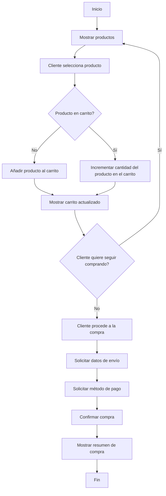

```mermaid
graph TD
    A[Inicio] --> B[Mostrar productos]
    B --> C[Cliente selecciona producto]
    C --> D{Producto en carrito?}
    D -->|No| E[Añadir producto al carrito]
    D -->|Sí| F[Incrementar cantidad del producto en el carrito]
    E --> G[Mostrar carrito actualizado]
    F --> G[Mostrar carrito actualizado]
    G --> H{Cliente quiere seguir comprando?}
    H -->|Sí| B
    H -->|No| I[Cliente procede a la compra]
    I --> J[Solicitar datos de envío]
    J --> K[Solicitar método de pago]
    K --> L[Confirmar compra]
    L --> M[Mostrar resumen de compra]
    M --> N[Fin]
```
